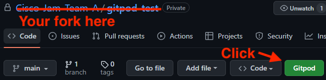
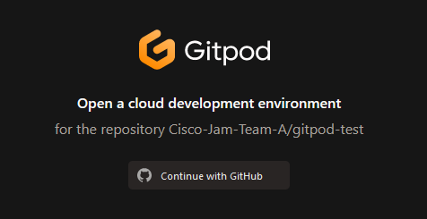
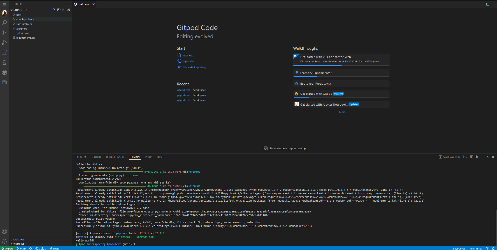
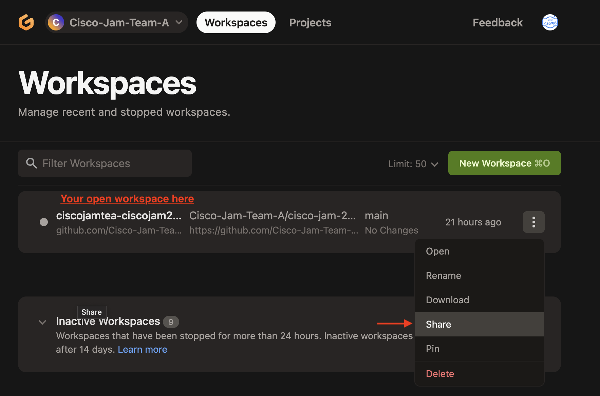
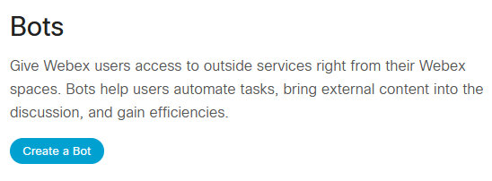
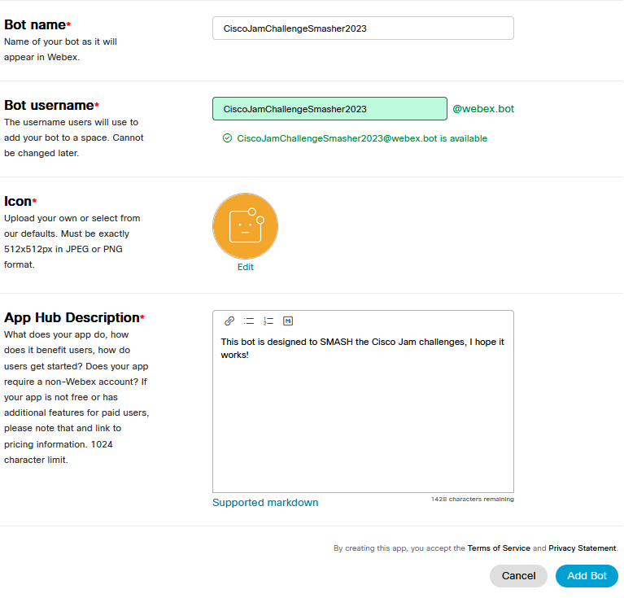
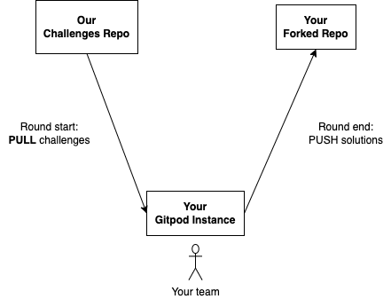

# Cisco Jam 2023 Setup Guide

## Add the Gitpod browser extension to your browser

Gitpod is an online development environment setup to allow you to start coding with all of the necessary dependencies for writing a webex bot, without any dependency installation needed on your own machine.

Click the link below to get the gitpod extension for your browser:

* [Chrome / Edge / Brave / Chromium-based browsers](https://chrome.google.com/webstore/detail/gitpod-always-ready-to-co/dodmmooeoklaejobgleioelladacbeki)
* [Firefox](https://addons.mozilla.org/en-US/firefox/addon/gitpod/)
* Unfortunately, Safari does not appear to be suppoorted at this time.

Click the button to 'Add to Chrome/Firefox'

Click `OK` when the gitpod popup asks permission to run in your browser.
If you're running a private browser session you can allow this extension to run in private windows.

## Fork this repo

A fork is basically just a copy of another repo. When you fork a repo, the original repo is then reffered to as the "upstream" repo.

**One person** on your team needs to fork this repo. At the top right of the repo on `github.com`, click the "Fork" button. On the next screen, you can leave all the options as-is and click "Create fork".

## Open the forked repo with Gitpod

### 1: Click the `Gitpod` extension button to open your workspace in the browser.


### 2: Follow the prompt to `Continue with GitHub`


### 3: You will see a 'Preparing to open workspace' notification as the workspace spins up. This may take a few minutes.

### 4: You should be logged into your workspace now.


## Getting your team on Gitpod together

At this point, you should have one person logged into a gitpod workspace.

Now it's time for the rest of your team to join. First, whoever forked the repo should visit: https://gitpod.io/workspaces.

Simply enable **share** for your open workspace:



Now, anyone on your team can visit the **URL** for your open workspace, and work together.

## Python cheatsheet

If you want to get up to speed on Python as quick as possible, take a look at `cheatsheet.py`.

You can actually run the cheat sheet too: just run `python3 cheatsheet.py` in the terminal. Feel free to make changes in there to see how the language works.

## Create your own Bot!

You will now elect someone in your team to create a bot (you can all create a bot, but just one will be used during the challenges)
Login to your [Webex Developer Account](https://developer.webex.com) and have a look at the [Bots](https://developer.webex.com/docs/bots) page.
Here you will see instructions on how to create your very own Webex Bot!
* Click the `Create Bot` button.

* Give your bot a name. Keep in mind that you will be pinging this bot in your team space, so `probablybestnotothavetoolongabotnameforconvenience`!
* Your bot username will allow you to add it quickly to your space. Save this for later!
* Choose an Icon, or upload your own!
* Give your bot a description
* Click the `Add Bot` button.

* **Imprtant** - The next page will contain your `Bot Access Token` which you will need again when you set up your bot in gitpod so copy this and keep it somewhere safe. This token can not be generated a second time, if you lose it you will need to create another bot!

### Add your Bot Access Token to your bot.
You now need to add the access token you generated when you created your bot in the developer portal, to your bot in gitpod! This will allow your bot to communicate with Webex, and integrate into your team space for the challenges.
* In the gitpod directory, you should see the following folder layout:
    - Challenges
        - bots - all your bot stuff lives in here
        - challenge 1 - your Round 1 challenges
        - challenge 2 - your Round 2 challenges
        - challenge 3 - your Round 3 challenges
* In the bots directory you will find a run-bot.sh shell script.
    - Add your access token to the shell script, it should look like the following:
    - `WEBEX_TEAMS_ACCESS_TOKEN=<Put Your Access Token Here - you dont need the angle brackets> python3 team_bot.py`

## Run your bot

The following command will launch your bot and allow you to ping the bot in your team challenge space in Webex:

```sh
# Allow run-bot.sh to be executed
chmod +x run-bot.sh
# Start your bot
sh ./run-bot.sh
```

### Add your bot to your team's space

* In your team's space, you should see tabs for 'Messages' 'People(the amount of people in the space)' 'Content'
    - In the 'People' tab, use the `Add People` button to add your bot.
    - Use the bot username you set up during the create your bot section to add it to your space.
    - It should be something like `yourBotName@webex.bot`

### Ping your bot in your team space

* To ping your bot in your team space, use the '@' symbol followed by your bot name
    - Try `@YourBotName hello`. You'll be implementing the functionality for that command in Round 1!

### Set your Bot Name in team_bot.py

* This file sets up your bot. You shouldn't need to work in here during the challenges, but it might still be interesting to see.
* Have a look and see if you can set the bot name to your team name, and ping it in your space to see it change.

## Start and end of round actions

At the **start** of each round, you need to **pull** the next round challenges from our upstream repo:



To do so, use the following commands:

```sh
# Pull down new challenges
git pull https://github.com/CiscoJamGalway2023/jam.git master
# Push them up to your fork
git push
```

Then, at the **end** of each round, you should **push** your solution, so that we can take a look 👀

To do so, use the following command from the repo root on the `master` branch:

```sh
# Add all modified files to a new commit
git commit -am "Solve Round 1 challenges (or whatever message here)"
# Push your commit to your fork
git push
```

Only one team member needs to do this.

**Need help?** Don't be shy! Just flag one of us down and we can help you out.

## Challenges

Each round has it's own challenge folder: `challenge1`, `challenge2`, and `challenge3`. During each round, read the instructions in `challenge.md`, and complete the corresponding function in `command.py`. `command.py` is hooked up to your bot already, so implementing the function will implement the bot command.
